# A basic guide for unity game mods (BepInEx setup not included)

The first thing you will need to do is get [Visual Studio](https://visualstudio.microsoft.com) installed. Download the comunity edition as its free.

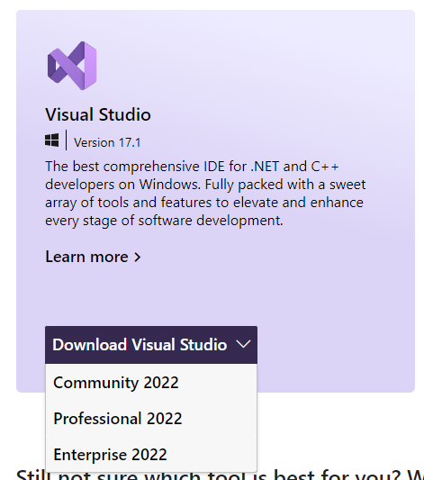

Once you have Visual studio (VS) Installed and launched you will have to add some packages. You need .NET desktop development.

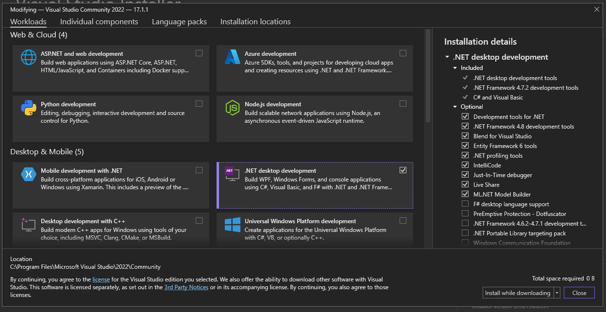

After the selected packages have been installed you will have to make a project for your mod. Click "Create a new project".

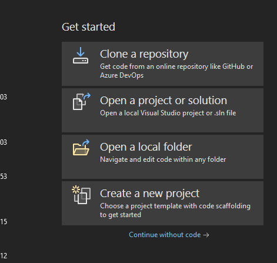

Now you will have to find the C# Class Library template, the description should be "A project for creating a class library that targets .NET or .NET Standard"
If you are unable to find that spicific template the "Class Library (.NET Framework)" will also work fine.

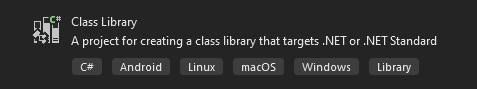
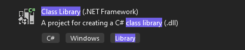

## Before you set up the class you need to get the dependencies

First you need to go to your games folder. I will be using Gorilla Tag as my game.

Now you will need to follow the path Gorilla Tag_Data\Managed and you can now get all the dependencies you need. Copy them to a place you can find again.

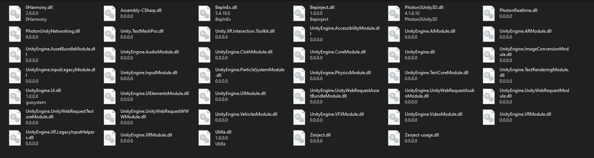

Files such as 0Harmony.dll, BepInEx.dll, Bepinject.dll, Utilla.dll, Zenject.dll, and Zenject-usage.dll will not be in this folder and some is made for other mods.

After this you need to go to Gorilla Tag\BepInEx\core and get the following files. 0Harmony.dll and BepInEx.dll and copy them to a place you can find again.

# Class Library Setup

Once you have selected this template and clicked next you can give it a name and a save location you can find.

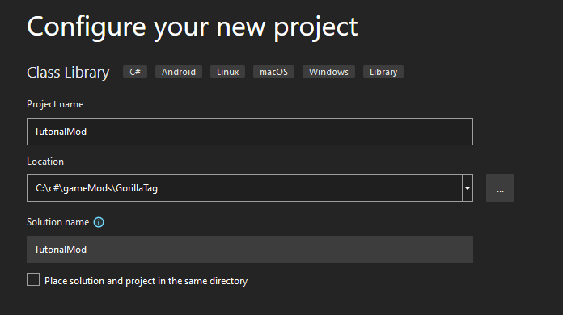

After that you will need to select ".NET Standard 2.0"

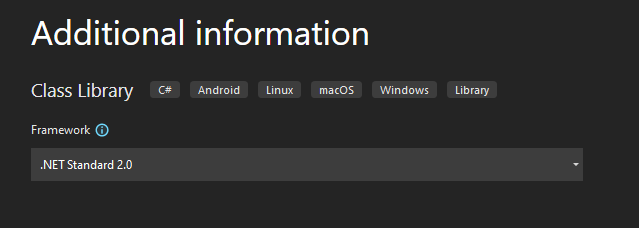

After creating the project you can add the dependencies you just copied from the game.
Right-click "Dependencies" and click "Add Project Reference".

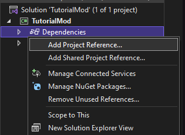

Click "Browse" and find your folder with the dependencies you just copied. Click Ctrl + A to select everything and click Add and click OK.

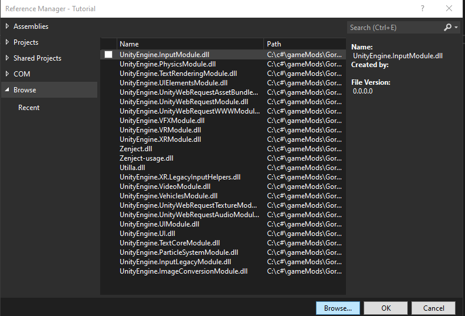

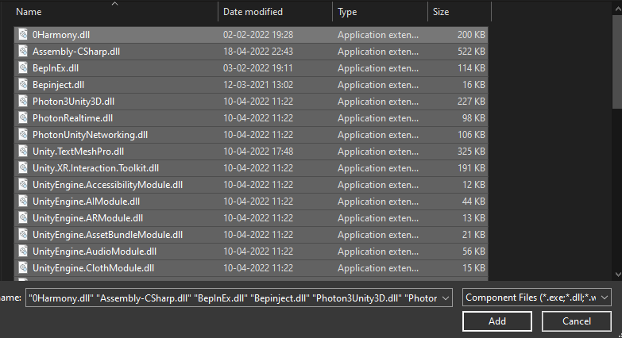

Now VS may take some time to add them, VS may even stop responding, but just keep waiting.

Now that you can see all the dll files added you can start making the mod.

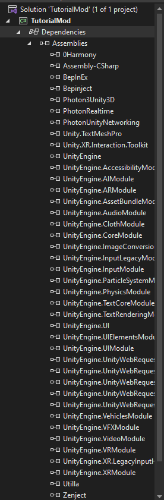

To see how a mod could look I have a [link](https://github.com/jona939s/Trail-monkey/blob/main/Class1.cs) to one of my old mods. Pay attention to harmony and bepinex.

# Class Library(.NET Framework) Setup

Oncy you have selected the template and clicked next you can give it a name and a save path you can find. You should also choose the lates framework version

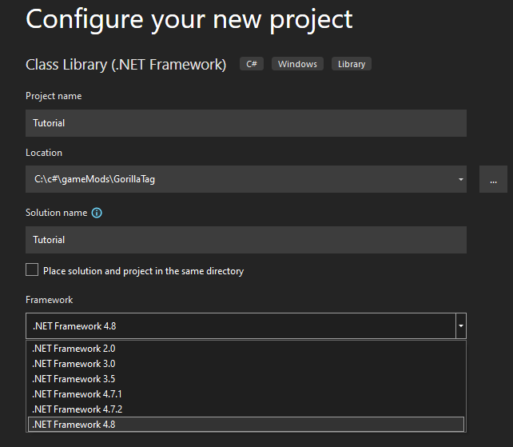

Now you will have to right-click "References" and click "Add Reference".

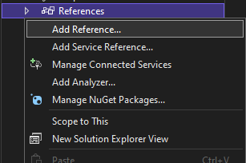

Click "Browse" and find your folder with the dependencies you just copied. Click Ctrl + A to select everything and click Add and click OK.

Now VS may take some time to add them, VS may even stop responding, but just keep waiting.

Now that you can see all the dll files added you can start making the mod.

To see how a mod could look I have a [link](https://github.com/jona939s/Trail-monkey/blob/main/Class1.cs) to one of my old mods. Pay attention to harmony and bepinex.
